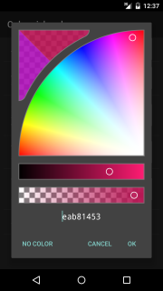
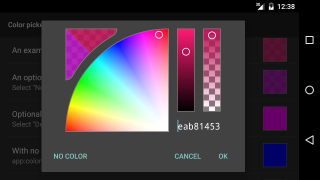
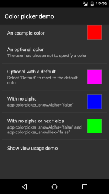

# HSV-Alpha Color Picker for Android

This library implements a color picker and a color preference for use in Android applications.

  

## Features

I couldn't find this combination of features in an existing library, which is why I wrote this one:

* Alpha slider.
* Text field to copy and paste hex color values.
* Old and new colors displayed side by side.
* Optional selection of "no color".
* Proper behavior when orientation changes.
* Up-to-date design.

In addition, the Hue-Saturation picker...

* gives higher hue precision than a square picker of the same size.
* allows easier selection of pure white than a circular picker.

## Demo App

A demo is [available on the Play Store](https://play.google.com/store/apps/details?id=com.rarepebble.colorpickerdemo).
Source code for the app is in the *demo_app* folder in this repo.

## Using the Library

Add the library dependency to your app module's *build.gradle*:

```groovy
    dependencies {
        compile 'com.rarepebble:colorpicker:2.3.0'
    }
```
Add *jcenter()* to your repository list if it isn't there already.

## ColorPreference Usage

Add the *ColorPreference* to your preference screen xml. Don't forget the extra *xmlns:*
declaration if using the custom attributes described below.

```xml
    <PreferenceScreen
        xmlns:android="http://schemas.android.com/apk/res/android"
        xmlns:app="http://schemas.android.com/apk/res-auto">

        <com.rarepebble.colorpicker.ColorPreference
            android:key="simplePreference"
            android:title="@string/pref_title"
            android:defaultValue="#f00"
            />

    </PreferenceScreen>
```

### XML Preference Attributes

The standard [preference attributes](https://developer.android.com/reference/android/preference/Preference.html#lattrs)
apply as normal, including *defaultValue*, which can be a hex color, as in the example above, or a
reference to a color defined elsewhere.

In addition, the following custom attributes may be used. They should be prefixed with the
namespace used for *res-auto*, as in the example below.

#### colorpicker_selectNoneButtonText

If set, this text will appear on a third button on the color picker dialog.
This resets the color setting to the *defaultValue* if set.
If there is no *defaultValue*, any saved color setting is removed. Apps can use this to implement
"no color selected" logic. Use *SharedPreference.contains("myOptionalColorKey")* to test for that.

#### colorpicker_noneSelectedSummaryText

This text displays as the preference summary text if no color has been selected.

#### colorpicker_showAlpha

Set this to false to hide the alpha slider.

#### colorpicker_showHex

Set this to false to hide the hex value field.

#### colorpicker_showPreview

Set this to false to hide the color preview field.

**Note:** *colorpicker_defaultColor* was removed in version 2, in favour of *android:defaultValue*.
If upgrading, just switch to using *android:defaultValue* instead.


```xml
    <PreferenceScreen
        xmlns:android="http://schemas.android.com/apk/res/android"
        xmlns:app="http://schemas.android.com/apk/res-auto">

        <com.rarepebble.colorpicker.ColorPreference
            android:key="myOptionalColor"
            android:title="@string/pref_optional_color"
            app:colorpicker_selectNoneButtonText="@string/no_color"
            app:colorpicker_noneSelectedSummaryText="@string/no_color_selected"
            />
    </PreferenceScreen>
```

There are further examples in the demo app.

## ColorPickerView Usage

In many cases, the *ColorPreference* will be all that's needed, but if you wish to use the
*ColorPickerView* directly, it can be constructed like any other view, either in code or in XML.
Set the initial color with *setColor()* and retrieve the view's current color with *getColor()*:

```java
    final ColorPickerView picker = new ColorPickerView(getContext());
    picker.setColor(0xff12345);
    ...
    final int color = picker.getColor();
```

Refer to the [ColorPreference source](colorpicker/src/main/java/com/rarepebble/colorpicker/ColorPreference.java?ts=4)
for a fuller example.

### XML View Attributes

The custom attributes above should be prefixed with the namespace used for *res-auto*, just like
the preference attributes. See the [view demo source](demo_app/src/main/res/layout/view_demo.xml)
for an example.

#### colorpicker_showAlpha

Set to false to hide the alpha slider. (Default is visible.)

#### colorpicker_showHex

Set to false to hide the hex value field. (Default is visible.)

#### colorpicker_showPreview

Set to false to hide the color preview field. (Default is visible.)

### ColorPickerView methods

#### public int getColor()

Gets the current color.

#### public void setColor(int color)

Sets the original color swatch and the current color to the specified value.

#### public void setOriginalColor(int color)

Sets the original color swatch without changing the current color.

#### public void setCurrentColor(int color)

Updates the current color without changing the original color swatch.

#### public void showAlpha(boolean showAlpha)

Shows or hides the alpha slider.

#### public void showHex(boolean showHex)

Shows or hides the hex value field.

#### public void showPreview(boolean showPreview)

Shows or hides the color preview field.

#### public void addColorObserver(ColorObserver observer)

Allows an object to receive notifications when the color changes.

## Bugs

Please report bugs in the GitHub issue tracker.

## License

Licensed under the Apache License, Version 2.0 (the "License");
you may not use this file except in compliance with the License.
You may obtain a copy of the License at

http://www.apache.org/licenses/LICENSE-2.0

Unless required by applicable law or agreed to in writing, software
distributed under the License is distributed on an "AS IS" BASIS,
WITHOUT WARRANTIES OR CONDITIONS OF ANY KIND, either express or implied.
See the License for the specific language governing permissions and
limitations under the License.
